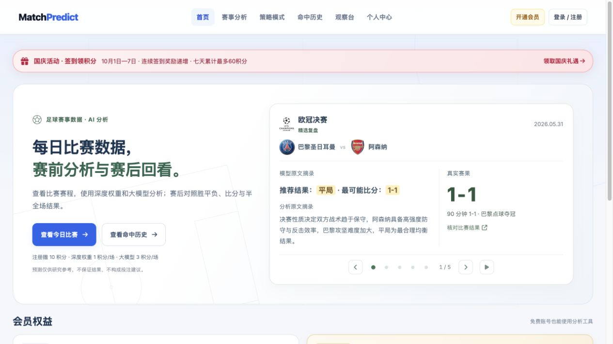
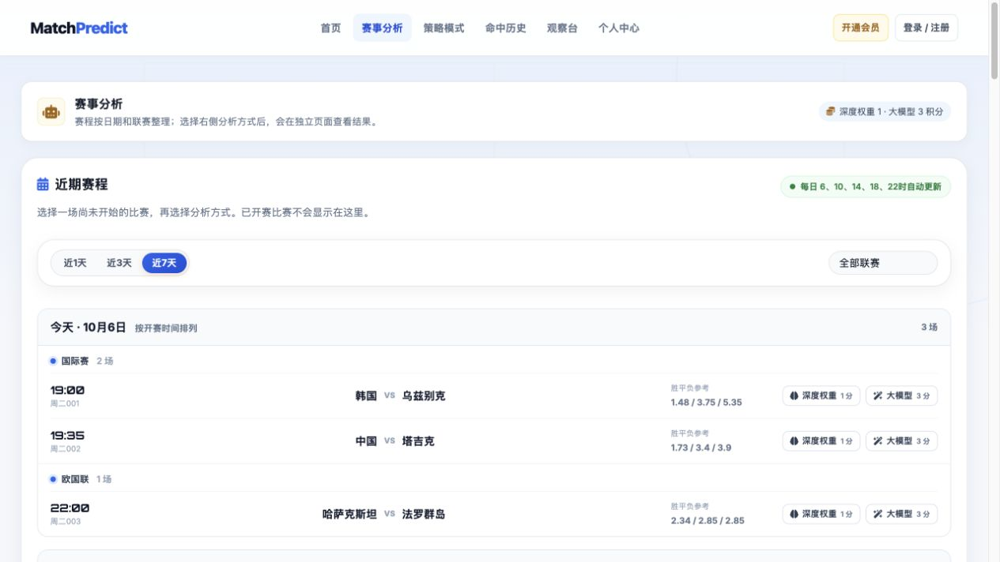
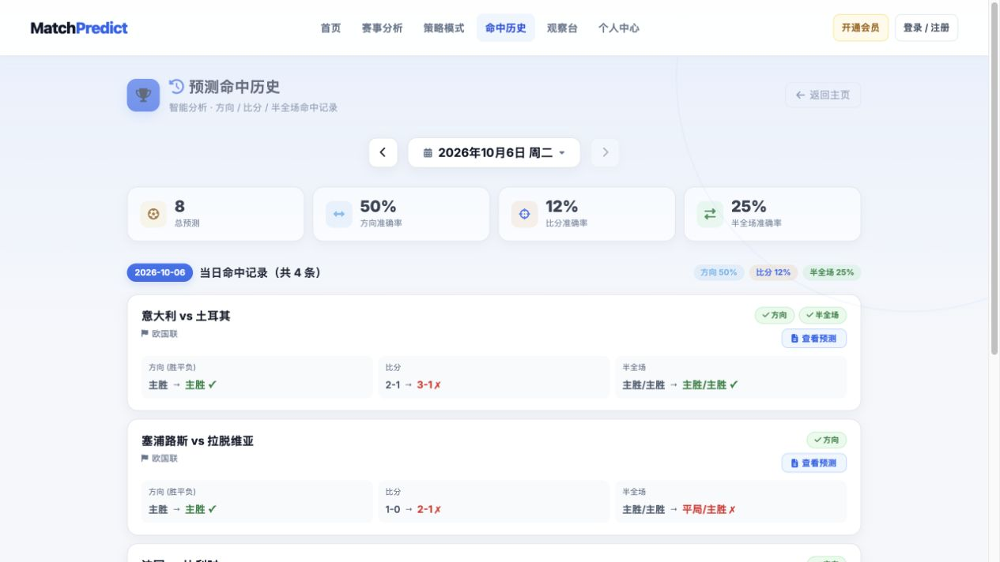

<div align="center">

# ⚽ MatchPredict

### 每日足球赛事数据 · 赛前分析 · 赛后复盘

不用搭环境，打开网站即可查看赛程和公开复盘。

[](https://match-predict.vercel.app/?utm_source=github&utm_medium=readme&utm_campaign=public_repo)
[](https://match-predict.vercel.app/history?utm_source=github&utm_medium=readme&utm_campaign=public_repo)

**[查看今日比赛](https://match-predict.vercel.app/?utm_source=github&utm_medium=readme&utm_campaign=public_repo#analysis)** · **[查看观察台](https://match-predict.vercel.app/research?utm_source=github&utm_medium=readme&utm_campaign=public_repo)** · **[反馈与建议](https://github.com/Scodive/MatchPredict/issues)**

</div>

[](https://match-predict.vercel.app/?utm_source=github&utm_medium=readme&utm_campaign=public_repo)

> **想直接使用？请进入在线版。** 本仓库提供早期基础示例，不是当前线上系统的完整源码；最新功能与每日数据在网站持续更新。截图拍摄于 2026-10-06，页面中的活动与赛程以实际网站为准。

## 在线版可以做什么？

- **看赛程**：按日期、联赛浏览近期比赛，覆盖五大联赛、欧国联等赛事。
- **看分析**：选择深度权重或大模型分析，查看胜平负、比分、半全场参考及分析理由。
- **看复盘**：把预测内容与真实赛果放在一起，分别核对方向、比分和半全场。
- **看观察台**：集中查看赛事趋势、足球资讯、联赛积分榜，保存关注并回看结果。

**第一次使用：** 先浏览公开复盘 → 注册账号 → 选择比赛和分析方式。注册赠 10 积分；收费与会员权益在站内明示，部分功能需要积分或会员。

**[进入网站，开始体验 →](https://match-predict.vercel.app/?utm_source=github&utm_medium=readme&utm_campaign=public_repo)**

<details>
<summary><b>展开查看线上赛程和公开历史页面</b></summary>

### 赛事分析

[](https://match-predict.vercel.app/?utm_source=github&utm_medium=readme&utm_campaign=public_repo#analysis)

### 公开复盘

[](https://match-predict.vercel.app/history?utm_source=github&utm_medium=readme&utm_campaign=public_repo)

</details>

## 先看模型实际输出

首页的五场精选复盘保留原文摘录，并与真实赛果对照。例如：

- **欧冠决赛，巴黎圣日耳曼 vs 阿森纳**：原文给出“平局”“1-1”；90 分钟赛果 1-1，巴黎通过点球夺冠。
- **世界杯揭幕战，墨西哥 vs 南非**：比分参考 2-0，半全场参考主胜 / 主胜，与赛果对应。
- **欧国联，捷克 vs 克罗地亚**：比分参考 1-2，半全场参考平局 / 客胜，与赛果对应。

**[查看原文摘录与赛果对照 →](https://match-predict.vercel.app/?utm_source=github&utm_medium=readme&utm_campaign=public_repo)**

### 公开复盘展示统计

**73.8% · 方向匹配率 · 同场多记录择优展示口径**

2026-09-23 至 2026-10-06，公开复盘展示的 84 场已完赛记录中，62 场方向匹配。覆盖连续 14 个自然日，有数据的 12 天全部计入，不只挑高命中率日期。

**该数字不是模型整体准确率。** 公开复盘对同场多条记录按命中情况择优展示，不能视为“一场一次、赛前固定预测”的独立回测，也不是比分准确率或收益率。精选案例同样不能代表所有比赛。完整日期、每日分母和指标口径见[统计说明](docs/performance-snapshot.md)，后续数据以[公开历史页面](https://match-predict.vercel.app/history)为准。

## 我们如何分析一场比赛？

1. **整理数据**：比赛赛程、球队攻防、近期表现、主客场差异与市场参考信息。
2. **建立参考**：用统计方法形成胜平负和比分分布，区分方向判断与精确比分。
3. **补充解释**：大模型结合赛事背景输出结构化分析，说明判断依据与不确定性。
4. **赛后核对**：同步真实结果，分别检查方向、比分和半全场，不把不同指标混成一个“成功率”。

这里介绍的是分析流程。线上使用的完整权重、提示词、校准细节、数据处理与运营组件不包含在本仓库中；开源示例也不保证复现线上结果。

## 本仓库与在线版的区别

**在线版：日常使用入口。** 每日赛程、当前分析工具、观察台、个人记录与会员服务均在网站。

**本仓库：基础学习示例。** 保留旧版 Flask 页面、浏览器端计算和历史数据脚本，方便阅读早期实现。当前可验证的最小闭环是本地历史数据 → 命令行计算 → 概率输出；网站的账户、数据库和 AI 服务链路尚不完整。

### 跑一个已验证的本地示例

在 Python 3.10 环境中验证过以下命令，不需要线上数据库或 API 密钥。其他 Python 版本未作完整验收。

```bash
git clone https://github.com/Scodive/MatchPredict.git
cd MatchPredict
python -m venv .venv
# macOS / Linux
source .venv/bin/activate
# Windows PowerShell 使用：.venv\Scripts\Activate.ps1
python -m pip install pandas numpy scipy
python scripts/parlay_predictor.py --matches matches.json
```

使用仓库自带的 2024 年示例数据，输出单场概率和旧版组合计算结果。这是程序运行演示，不是预测准确率测试，也不代表当前球队状态。原脚本中的旧版术语不构成投注建议。

**不要把旧 Web 示例直接作为生产服务部署。** 首页和球队接口可加载，但数据库、AI 及实时赛程不可完整使用；旧页面还存在将模型密钥传给浏览器的设计。详见[运行检查与已知限制](docs/open-source-status.md)。本次文档整理未修改运行代码。

## 文件导航

```text
MatchPredict/
├── README.md               # 在线入口与项目介绍
├── docs/
│   ├── README.md           # 文档索引
│   ├── images/             # 当前线上网站的真实截图
│   ├── performance-snapshot.md
│   ├── open-source-status.md
│   └── legacy/             # 旧版开发说明，保留原文
├── app.py                  # 旧版 Flask 示例，保持原样
├── scripts/                # 原有计算与数据处理脚本
├── static/                 # 原有前端资源
├── templates/              # 原有页面模板
├── data/                   # 原有历史示例数据
├── js/                     # 历史前端文件，暂不合并
└── logos/                  # 原有图标
```

历史开发说明已集中到 `docs/legacy/`，不再占据首页。重复的前端目录没有擅自合并，以免改变旧代码的引用关系。

## 反馈与使用边界

使用问题可在站内反馈，也可以[提交 Issue](https://github.com/Scodive/MatchPredict/issues)。Star / Watch 可以关注公开仓库；最新产品更新请以网站为准。

本项目用于足球数据研究与技术展示，不保证预测结果，不提供收益承诺，不构成投注建议。数据使用须遵守来源方条款。当前仓库未附独立代码许可证；如需复用或商用，请先联系维护者确认授权，不将“仓库公开”视为无限制使用许可。

**[打开 MatchPredict 在线版 →](https://match-predict.vercel.app/?utm_source=github&utm_medium=readme&utm_campaign=public_repo)** · [用户协议](https://match-predict.vercel.app/terms)
